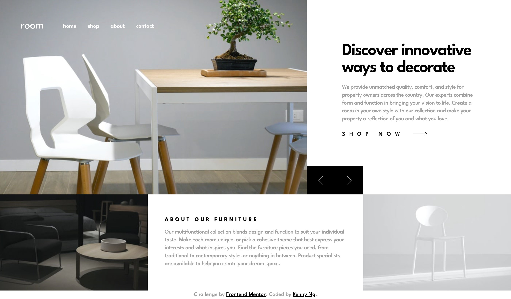
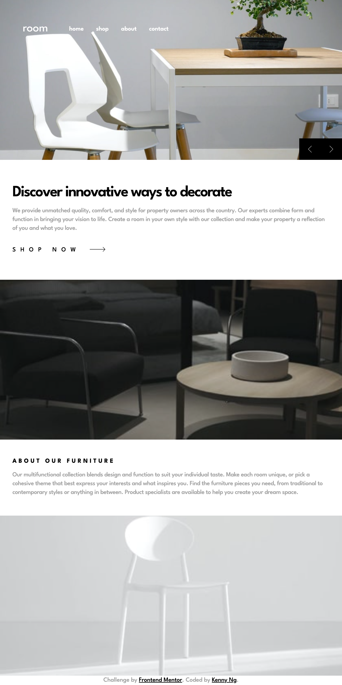
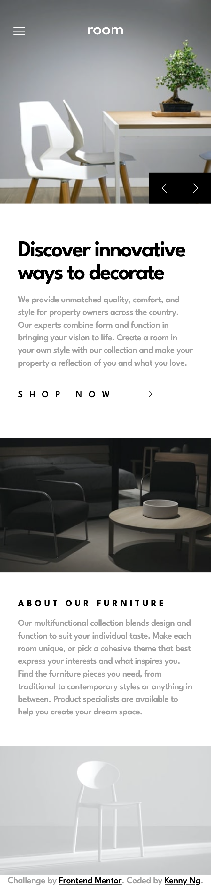

# Frontend Mentor - Room homepage solution

This is a solution to the [Room homepage challenge on Frontend Mentor](https://www.frontendmentor.io/challenges/room-homepage-BtdBY_ENq). Frontend Mentor challenges help you improve your coding skills by building realistic projects.

## Table of contents

- [Overview](#overview)
  - [The challenge](#the-challenge)
  - [Screenshot](#screenshot)
  - [Links](#links)
- [My process](#my-process)
  - [Built with](#built-with)
  - [What I learned](#what-i-learned)
  - [Useful resources](#useful-resources)
- [Author](#author)

## Overview

### The challenge

Users should be able to:

- View the optimal layout for the site depending on their device's screen size
- See hover states for all interactive elements on the page
- Navigate the slider using either their mouse/trackpad or keyboard

### Screenshot

<p>Desktop version</p>

<p>Tablet version</p>

<p>Mobile version</p>


### Links

- Solution URL: [https://www.frontendmentor.io/solutions/responsive-roomhomepage-using-nextjs-css-grid-flexbox-VHUhIoqugT](https://www.frontendmentor.io/solutions/responsive-roomhomepage-using-nextjs-css-grid-flexbox-VHUhIoqugT)
- Live Site URL: [https://fm-room-homepage-kennylun123.vercel.app/](https://fm-room-homepage-kennylun123.vercel.app/)

## My process

### Built with

- Semantic HTML5 markup
- CSS custom properties
- Flexbox
- CSS Grid
- Mobile-first workflow
- [React](https://reactjs.org/) - JS library
- [Next.js](https://nextjs.org/) - React framework
- CSS Modules
- CUBE CSS

### What I learned

- `srcset` and `sizes` properties of `` element. I've only used `srcset` in my project.

```HTML

```

- Enforcement learning of image sizing and positioning with slider and slide control. Refer to "slider.js" & "slider.module.css".

- For eaiser sizing control of `<svg>` element, I used `viewBox` attribute and set its width and height in CSS.

```html
<svg viewBox="0 0 14 24" xmlns="http://www.w3.org/2000/svg">
  <path d="M13 0L1 12l12 12" stroke="#FFF" fill="none" fillRule="evenodd" />
</svg>
```

### Useful resources

- [Responsive images by MDN](https://developer.mozilla.org/en-US/docs/Learn/HTML/Multimedia_and_embedding/Responsive_images) - Example of applying `srcset`, `sizes` and `<picture>`
- [viewBox attribute of svg element](https://developer.mozilla.org/en-US/docs/Web/SVG/Attribute/viewBox)

## Author

- Website - [Kenny Ng](https://github.com/kennylun123?tab=repositories)
- Frontend Mentor - [@kennylun123](https://www.frontendmentor.io/profile/kennylun123)
- Twitter - [@kenny_ng123](https://www.twitter.com/kenny_ng123)
